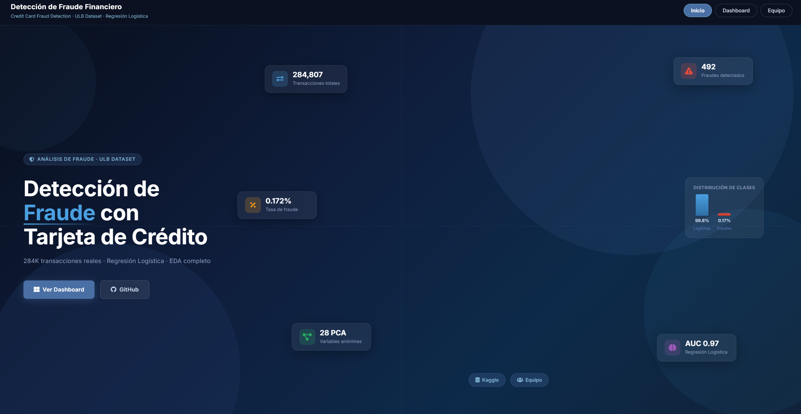

# Detección de Fraude Financiero — EDA Dashboard



------------------------------------------------------------------------

## Contexto del proyecto

El fraude con tarjeta de crédito representa una amenaza creciente para el sistema financiero global. Detectarlo a tiempo es crítico para proteger a los usuarios, reducir pérdidas millonarias y mantener la confianza en los sistemas de pago electrónico.

Este proyecto realiza un análisis exploratorio completo sobre el dataset **Credit Card Fraud Detection** del ULB Machine Learning Group, que contiene 283.726 transacciones reales de titulares de tarjetas europeos registradas durante septiembre de 2013. A través del análisis, se identifican los patrones estadísticos y temporales que distinguen las transacciones fraudulentas de las legítimas.

Una de las principales características del dataset es el **desbalance extremo de clases**: solo el 0.17% de las transacciones son fraudulentas, lo que representa un ratio de aproximadamente 599:1. Este desbalance es uno de los principales desafíos del análisis.

------------------------------------------------------------------------

## Problema

Las entidades financieras deben equilibrar dos costos contrapuestos: el costo del fraude no detectado (pérdidas directas) y el costo de los falsos positivos (bloqueo de transacciones legítimas). Este dashboard permite explorar los patrones del dataset para entender mejor este problema antes de abordar cualquier solución predictiva.

------------------------------------------------------------------------

## Contenido del dashboard

El dashboard está organizado en las siguientes secciones:

-   **Introducción** — contexto del fraude financiero e impacto en el sistema financiero
-   **Contexto** — costos del fraude, falsos positivos y desbalance de clases
-   **Problema** — distribución de clases, análisis de Amount y frecuencia temporal
-   **Objetivos** — metas del análisis exploratorio
-   **Marco teórico** — fundamentos de clasificación binaria, PCA y operacionalización de variables
-   **Metodología** — descripción del dataset, limpieza, preprocesamiento y estrategia de análisis
-   **Resultados** — análisis univariado, bivariado, temporal y de correlaciones con pruebas no paramétricas (Mann-Whitney, RBC)
-   **Limitaciones** — desbalance, falta de interpretabilidad de variables PCA y restricciones del EDA
-   **Conclusiones** — hallazgos clave y líneas futuras

------------------------------------------------------------------------

## Ejecutar la aplicación

**Requisitos previos:** tener instalado R (versión 4.1 o superior) y RStudio.

**1. Obtener el proyecto**

Opción A — clonar con git:
```bash
git clone https://github.com/Mary-Yepes/FraudDetection-Shiny.git
```

Opción B — descargar el ZIP directamente desde GitHub (botón verde "Code" → "Download ZIP") y descomprimir.

**2. Instalar los paquetes necesarios:**

Abre RStudio y en la **consola de R** ejecuta:

```r
install.packages(c(
  "shiny", "bslib", "dplyr", "tidyr", "readr",
  "ggplot2", "plotly", "DT", "scales",
  "corrplot", "car", "purrr", "e1071"
))
```

**3. Colocar el dataset:**

Descarga `creditcard.csv` desde [Kaggle](https://www.kaggle.com/datasets/mlg-ulb/creditcardfraud) y colócalo dentro de la carpeta `data/` del proyecto.

**4. Ejecutar:**

Abre `app.R` en RStudio y ejecuta:

```r
shiny::runApp()
```

------------------------------------------------------------------------

## Estructura del proyecto

```         
proyecto/
├── app.R                  # Aplicación principal
├── data_prep.R            # Carga y limpieza del dataset
├── R/
│   ├── utils.R            # Funciones auxiliares y helpers de UI
│   ├── mod_introduccion.R
│   ├── mod_contexto.R
│   ├── mod_problema.R
│   ├── mod_objetivos.R
│   ├── mod_marco_teorico.R
│   ├── mod_metodologia.R
│   ├── mod_resultados.R
│   ├── mod_limitaciones.R
│   └── mod_conclusiones.R
├── data/
│   └── creditcard.csv
└── www/
    ├── styles.css
    └── hero_card.jpg
```

------------------------------------------------------------------------

## Equipo

Este proyecto fue desarrollado por:

-   **Alejandra Meneses Gómez** — [GitHub](https://github.com/alemengo76) - [Linkedln](https://www.linkedin.com/in/alejandra-meneses-g%C3%B3mez-aaa97b3b7/)
-   **Mariangel Yepes Negrete** — [GitHub](https://github.com/mary-yepes)

------------------------------------------------------------------------
